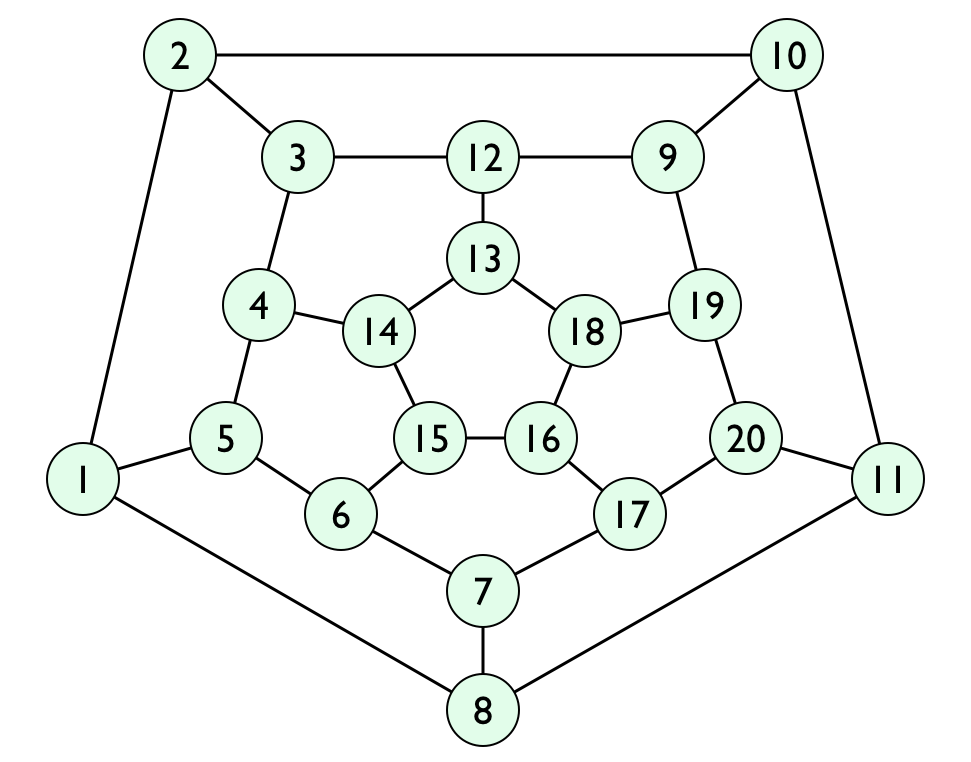

# Hunt the Wumpus Game

## Overview

Hunt the Wumpus is an early computer game, based on a simple hide and seek format featuring a mysterious monster (the Wumpus) that lurks deep inside a network of rooms. It was originally a text-based game written in BASIC. It has since been ported to various programming languages and platforms including graphical versions. [Source: [Wikipedia](https://en.wikipedia.org/wiki/Hunt_the_Wumpus)]

## Gameplay

gameplay is via a command-line text interface. These are the various features of the game:

* Objects:
  * Wumpus: your target; a beast that eats you if you ever end up in the same room.
  * Super Bats (2): creatures that instantly carry you to a random room.
  * Pits (2): fatal to you if you enter the room.
* Actions: There are two possible actions:
  * Move: to one of the three rooms connected to your current one.
  * Shoot: fire a "crooked arrow" a distance of 1-5 rooms; you must name each room it will reach.
* Warning messages: Give you information about the contents of adjacent rooms.
  * Wumpus: "I smell a wumpus"
  * Bat: "Bats nearby"
  * Pit: "I feel a draft"

## Map

The map was originally conceived as a *squashed dodecahedron* with each room having tunnels to three adjoining rooms. [[Source](http://www.atariarchives.org/bcc1/showpage.php?page=247)]

### Adjoining Rooms

The adjoining rooms are as follows:

| Room No | Adjoining Rooms | 
| --- | --- | 
| 1 | 2, 5, 8 |
| 2 | 1, 3, 10 |          
| 3 | 2, 4, 12 |
| 4 | 3, 5, 14 |
| 5 | 1, 4, 6 |
| 6 | 5, 7, 15 |
| 7 | 6, 8, 17 |
| 8 | 1, 7, 11 |
| 9 | 10, 12, 19 |
| 10 | 2, 9, 11 |
| 11 | 8, 10, 20 |
| 12 | 3, 9, 13 |
| 13 | 12, 14, 18 |
| 14 | 4, 13, 15 |
| 15 | 6, 14, 16 |
| 16 | 15, 17, 18 |
| 17 | 7, 16, 20 |
| 18 | 13, 16, 19 |
| 19 | 9, 18, 20 |
| 20 | 11, 17, 19 |
